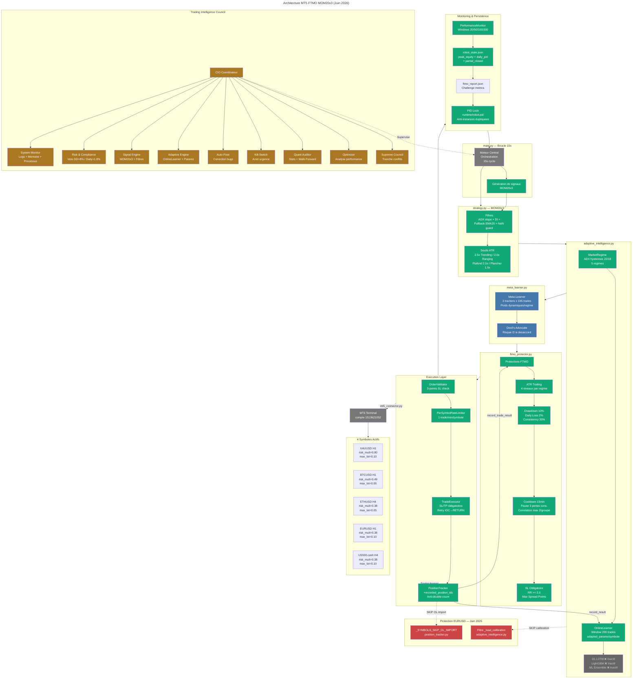
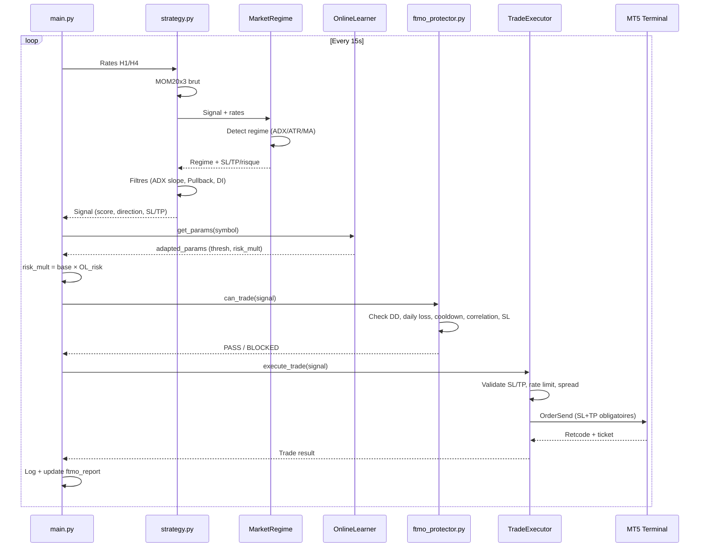
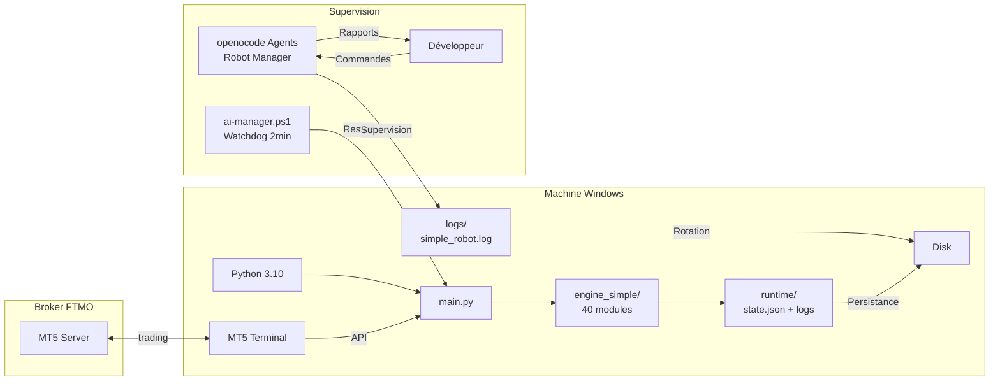
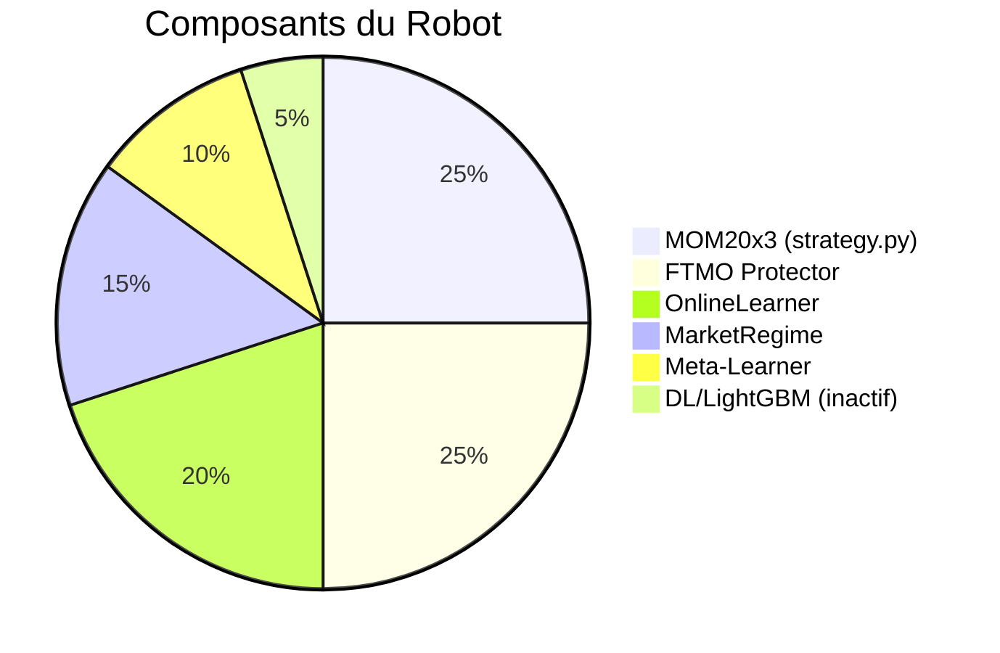

# Architecture du Robot MOM20x3 — Diagramme Complet

```mermaid
---
title: Architecture MT5 FTMO MOM20x3 (Juin 2026)
---
flowchart TB
    subgraph Main["main.py — Boucle 15s"]
        direction TB
        MC[Moteur Central<br/>Orchestration<br/>15s cycle] --> SIG
    end

    subgraph Strategy["strategy.py — MOM20x3"]
        direction TB
        SIG[Génération de signaux<br/>MOM20x3] --> FILT[Filtres<br/>ADX slope + DI +<br/>Pullback EMA20 + NaN guard]
        FILT --> SEUIL[Seuils ATR<br/>2.5x Trending / 2.0x Ranging<br/>Plafond 2.5x / Plancher 1.5x]
    end

    subgraph Adaptive["adaptive_intelligence.py"]
        direction TB
        REG[MarketRegime<br/>ADX hysteresis 22/18<br/>5 regimes] --> OL[OnlineLearner<br/>Window 200 trades<br/>adapted_params/symbole]
        OL --> DL[DL LSTM ❌ Inactif<br/>LightGBM ❌ Inactif<br/>ML Ensemble ❌ Inactif]
    end

    subgraph Meta["meta_learner.py"]
        direction TB
        META[Meta-Learner<br/>3 trackers x 195 trades<br/>Poids dynamiques/regime] --> DA[Devil's Advocate<br/>Risque /2 si desaccord]
    end

    subgraph FTMO["ftmo_protector.py"]
        direction TB
        PROT[Protections FTMO] --> TRAIL[ATR Trailing<br/>4 niveaux par regime]
        TRAIL --> DD[Drawdown 10%<br/>Daily Loss 2%<br/>Consistency 30%]
        DD --> COOLD[Cooldown 15min<br/>Pause 3 pertes cons.<br/>Correlation max 2/groupe]
        COOLD --> SL_CHECK[SL Obligatoire<br/>RR >= 2.0<br/>Max Spread Points]
    end

    subgraph Execution["Execution Layer"]
        direction TB
        VAL[OrderValidator<br/>3-points SL check] --> LIM[PerSymbolRateLimiter<br/>1 trade/min/symbole]
        LIM --> EXEC[TradeExecutor<br/>SL/TP obligatoires<br/>Retry IOC→RETURN]
        EXEC --> POS[PositionTracker<br/>+recorded_position_ids<br/>Anti-double-count]
    end

    subgraph Monitoring["Monitoring & Persistence"]
        direction TB
        PERF[PerformanceMonitor<br/>Windows 20/50/100/200] --> STATE[robot_state.json<br/>peak_equity + daily_pnl<br/>+ partial_closed]
        STATE --> FTMO_REP[ftmo_report.json<br/>Challenge metrics]
        FTMO_REP --> PID[PID Lock<br/>runtime/robot.pid<br/>Anti-instances dupliquees]
    end

    subgraph Symbols["4 Symboles Actifs"]
        XAU[XAUUSD H1<br/>risk_mult=0.80<br/>max_lot=0.10]
        BTC[BTCUSD H1<br/>risk_mult=0.49<br/>max_lot=0.05]
        ETH[ETHUSD H4<br/>risk_mult=0.38<br/>max_lot=0.05]
        EUR[EURUSD H1<br/>risk_mult=0.38<br/>max_lot=0.10]
        US500[US500.cash H4<br/>risk_mult=0.38<br/>max_lot=0.10]
    end

    subgraph ProtectionCouche["Protection EURUSD — Juin 2026"]
        SKIP_IMPORT[_SYMBOLS_SKIP_OL_IMPORT<br/>position_tracker.py]
        SKIP_CALIBRATION[Filtre _load_calibration<br/>adaptive_intelligence.py]
    end

    subgraph TradingCouncil["Trading Intelligence Council"]
        CIO[CIO Coordinateur] --> SM[System Monitor<br/>Logs + Memoire + Processus]
        CIO --> RC[Risk & Compliance<br/>Veto DD>8% / Daily>1.8%]
        CIO --> SE[Signal Engine<br/>MOM20x3 + Filtres]
        CIO --> AE[Adaptive Engine<br/>OnlineLearner + Params]
        CIO --> AF[Auto-Fixer<br/>Correction bugs]
        CIO --> KS[Kill-Switch<br/>Arret urgence]
        CIO --> QA[Quant Auditor<br/>Stats + Walk-Forward]
        CIO --> OP[Optimizer<br/>Analyse performance]
        CIO --> SC[Supreme Council<br/>Tranche conflits]
    end

    %% Flux principal
    MC --> Strategy
    Strategy --> Adaptive
    Adaptive --> Meta
    Meta --> FTMO
    FTMO --> Execution
    Execution --> Monitoring
    Monitoring --> MC

    %% Feedback loop
    Execution -->|Trades fermes| POS
    POS -->|record_result| OL
    POS -->|record_trade_result| PROT

    %% Protection EURUSD
    POS -.->|SKIP OL import| SKIP_IMPORT
    Adaptive -.->|SKIP calibration| SKIP_CALIBRATION

    %% Connexion MT5
    Execution -->|mt5_connector.py| MT5[MT5 Terminal<br/>compte 1513621052]
    MT5 --> Symbols

    %% Council supervision
    CIO -.->|Supervise| MC

    %% Styles
    classDef active fill:#1a7,color:#fff
    classDef inactive fill:#666,color:#ccc
    classDef protect fill:#c44,color:#fff
    classDef meta fill:#47a,color:#fff
    classDef infra fill:#777,color:#fff
    classDef council fill:#a72,color:#fff

    class SIG,FILT,SEUIL,REG,OL,PROT,TRAIL,DD,COOLD,SL_CHECK,VAL,LIM,EXEC,POS,PERF,STATE,PID active
    class DL inactive
    class SKIP_IMPORT,SKIP_CALIBRATION protect
    class META,DA meta
    class MC,MT5 infra
    class CIO,SM,RC,SE,AE,AF,KS,QA,OP,SC council
```

## Flux de décision temps réel

```mermaid
sequenceDiagram
    participant M as main.py
    participant S as strategy.py
    participant R as MarketRegime
    participant OL as OnlineLearner
    participant FTMO as ftmo_protector.py
    participant E as TradeExecutor
    participant MT5 as MT5 Terminal

    loop Every 15s
        M->>S: Rates H1/H4
        S->>S: MOM20x3 brut
        S->>R: Signal + rates
        R->>R: Detect regime (ADX/ATR/MA)
        R-->>S: Regime + SL/TP/risque
        S->>S: Filtres (ADX slope, Pullback, DI)
        S-->>M: Signal (score, direction, SL/TP)
        
        M->>OL: get_params(symbol)
        OL-->>M: adapted_params (thresh, risk_mult)
        M->>M: risk_mult = base × OL_risk
        
        M->>FTMO: can_trade(signal)
        FTMO->>FTMO: Check DD, daily loss, cooldown, correlation, SL
        FTMO-->>M: PASS / BLOCKED
        
        M->>E: execute_trade(signal)
        E->>E: Validate SL/TP, rate limit, spread
        E->>MT5: OrderSend (SL+TP obligatoires)
        MT5-->>E: Retcode + ticket
        E-->>M: Trade result
        
        M->>M: Log + update ftmo_report
    end
```

## Diagramme de déploiement

```mermaid
graph LR
    subgraph VPS["Machine Windows"]
        PY[Python 3.10] --> MAIN[main.py]
        MAIN --> ENGINE[engine_simple/<br/>40 modules]
        ENGINE --> RUNTIME[runtime/<br/>state.json + logs]
        
        MT5W[MT5 Terminal] -->|API| MAIN
        
        LOGS[logs/<br/>simple_robot.log] -->|Rotation| DISK[Disk]
        RUNTIME -->|Persistance| DISK
    end

    subgraph Broker["Broker FTMO"]
        SERVER[MT5 Server] <-->|trading| MT5W
    end

    subgraph Supervision["Supervision"]
        WD[ai-manager.ps1<br/>Watchdog 2min] -->|Restart| MAIN
        AGENTS[openocode Agents<br/>Robot Manager] -->|Supervision| LOGS
        AGENTS -->|Rapports| USER[Développeur]
    end

    USER -->|Commandes| AGENTS
```

## Composants actifs vs inactifs

```mermaid
pie title Composants du Robot
    "MOM20x3 (strategy.py)" : 25
    "FTMO Protector" : 25
    "OnlineLearner" : 20
    "MarketRegime" : 15
    "Meta-Learner" : 10
    "DL/LightGBM (inactif)" : 5
```
